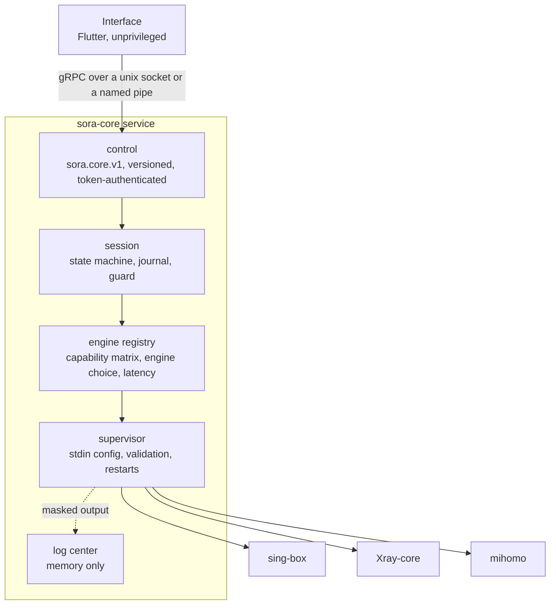

# Sora

[Русский](README.md) | English

Sora is an open-source proxy client built around one core that drives three
engines — sing-box, Xray-core and mihomo — and runs each connection on the engine
that can carry it. It is designed for networks that block, throttle and inspect:
the core picks the transport the network lets through, keeps nothing on the machine
that could give the user away, and explains every failure in plain words.

The client runs on Linux (.deb, .rpm and Arch packages) and on Windows 10 and 11
(an installer). Android is in progress. The previous client, Sora Legacy, lives on the
[`legacy`](https://github.com/levvs-one/sora-client/tree/legacy) branch.

## What the app does

- **One button.** Connecting, the state in a few words and the chosen server, on
  one screen. The button and the window edge glow while it connects; a failure is
  explained in words, not codes.
- **Subscriptions that look after themselves.** The core updates them on schedule,
  even with the window closed, and keeps them encrypted. You see how much traffic is
  spent, until when the subscription runs and what the provider says, with its links
  and `@names` tappable. Three days before it ends, or with a tenth of the traffic
  left, Sora says so on the home screen.
- **Xray JSON subscriptions (Remnawave).** Each profile runs as the provider wrote
  it, with its balancers, observatory and routing; Sora adds its own inbound, DNS,
  ad block and routing preset.
- **The fastest server, and a spare.** "Fastest" is picked by the core from
  measurements; a server picked by hand is backed by the others and switched on
  failure. Latency is measured over a warm connection, the way a person feels it.
- **Your own rules.** A site, an address, a network or a program — direct, through
  the VPN, or blocked. Rules by program work on all three engines.
- **No server.** DPI bypass through zapret (tpws) without a VPN server, with a
  configurable strategy.
- **Log center and connection center** one step away, with export and closing any
  connection.
- Simple settings first, fine ones below: engine, IPv6, DNS, TLS fragmentation, how
  latency is measured, how often subscriptions update. Light and dark, Russian and
  English, animations can be turned off.

## For providers: steering through server names

Sora reads an ordinary subscription — the same link Happ, v2rayN and Hiddify open.
Nothing has to be added to the panel: Sora understands server names.

**Same name, one line.** Servers of one subscription that share a name are one
entry in Sora. The fastest that answered carries the traffic; a server that did not
answer the measurement is never picked.

**A role at the end of the name sets the order.** The main ones first, the backups
when the main ones do not answer.

| Name in the subscription | In Sora |
| --- | --- |
| `Netherlands (main)` | **Netherlands**: traffic goes here |
| `Netherlands (backup)` | …and here when the main one does not answer |
| `Germany`, `Germany` | **Germany**: the faster of the two |
| `Белые списки · основной`, `Белые списки · запасной` | **Белые списки**: the same order in Russian |

Main: `main`, `primary`, `основной`, `главный`. Backup: `backup`, `reserve`,
`fallback`, `запасной`, `резерв`, `резервный`. Case does not matter; brackets, a
dash, a dot or a colon may come before the word. A server without a role in a group
that has roles is a backup.

mihomo keeps the order by role, and with the engine chosen automatically Sora runs
the group on it. With the engine pinned to sing-box or Xray only the main ones run —
the fastest of them. Profiles of an Xray JSON subscription switch in the app: the
next one takes over when the current one does not come up.

Other clients show the same servers one by one, under the same readable names.

## What the core does

**One plan, three engines.** A session is described once, independently of any
engine. The core knows what each engine build can carry — every entry of that
matrix is checked by the engine's own validator — and runs the plan on the first
engine, in the user's order, that carries all of it.

| Only here | Engine |
| --- | --- |
| XHTTP, VLESS Encryption, the Xray flavour of REALITY, observatory-driven balancing | Xray-core |
| AnyTLS, tun with its own routing table on every platform, the smallest footprint | sing-box |
| AmneziaWG 1.x and 2.0, fallback groups, controller over a socket, live reload | mihomo |

Protocols: VLESS (REALITY, XTLS Vision), VMess, Trojan, Shadowsocks (incl. 2022),
Hysteria2, TUIC, AnyTLS, WireGuard, AmneziaWG, SOCKS5, HTTP. Transports: raw, ws,
grpc, httpupgrade, xhttp.

**Built for censored networks.**

- TLS ClientHello fragmentation against SNI-based DPI, with tunable segment ranges.
- Latency measured with a real request through the engine that carries each server,
  streamed to the interface as results arrive; a connection check where no engine
  fits, and the result says which of the two it is.
- Geo databases ship with Sora, so the first connection never waits for a download
  from a host that is blocked.

**Nothing to find from the outside.**

- In tun mode there is no local proxy port: an app scanning loopback ports cannot
  route through the tunnel to learn the server address. A port for chosen apps is
  opt-in and can require a login.
- Engine control runs over a unix socket or a named pipe by default — no TCP port
  answers a scan.
- Credentials are stored encrypted (AES-256-GCM; the key is protected by DPAPI on
  Windows) and reach the engine over stdin, never through arguments or files.
- Server addresses, UUIDs, passwords and subscription links are masked in every
  log, event and diagnostic archive.

**Log center and connection center.** One in-memory record of the service and every
engine: filter by level, engine, text, RE2 pattern and time, follow it live, fold
repeats, export to text, JSON Lines or CSV. The log level changes on every engine
at once, without a reconnect. Visited destinations are hidden unless the user turns
them on, and nothing is written to disk. The connection center lists live
connections with their rule, group chain and traffic, and closes any of them.

**Recovery.** Engines are supervised child processes: a crash restarts the engine
with backoff inside a restart budget, every system change goes through a guard that
restores it on every exit path, and on Linux a kill switch built on its own
nftables table keeps traffic from leaking while the tunnel is down.

## How it is verified

| Check | What it proves |
| --- | --- |
| Engine validators | every rendered plan is accepted by `sing-box check`, `xray run -test` and `mihomo -t` |
| Interop | a real HTTP request goes through each engine over each transport to a local Xray server; a wrong UUID must fail on every engine, so a pass cannot be traffic that went around the proxy |
| Isolation | without a local proxy in the plan nothing listens; a locked listener refuses a request without its login — on all three engines |
| Masking | engine output reaches the log center and no credential does |
| Supervision | a fake engine built from the test binary crashes, gets restarted and exhausts its budget — in CI, with no engine installed |
| CI | race detector, builds for Windows, Linux and macOS on amd64 and arm64, golangci-lint, CodeQL, govulncheck, OSV, gitleaks, proto lint and breaking-change checks |

Engine builds verified: sing-box 1.14.2, Xray-core 26.3.27, mihomo 1.19.32.

## Architecture



Design notes: [core](docs/architecture/core.md), [engines](docs/architecture/engines.md),
[log and connection centers](docs/architecture/logs.md).

## Repository

| Directory | Contents |
| --- | --- |
| [`core`](core/README.md) | `sora-core` in Go: engines, control plane, subscriptions, secret store, guard, diagnostics, log center |
| [`proto`](proto/README.md) | The `sora.core.v1` contract between the interface and the core |
| [`app`](app/README.md) | The Flutter application for Windows, Linux, Android and Android TV |
| [`service`](service) | Installation and lifecycle of the core service on Windows and Linux |
| [`packaging`](packaging/README.md) | Installers and packages |

## Platforms

| System | What there is |
| --- | --- |
| Linux x64 | app and core: .deb, .rpm and Arch packages ([packaging/linux](packaging/linux/README.md)) |
| Linux ARM64 | core (Flutter publishes no Linux SDK for ARM64) |
| Windows 10 1809+ and 11, x64 | app, core as a service, installer ([packaging/windows](packaging/windows/README.md)) |
| Windows 7 SP1, x32 | Sora Legacy on the [`legacy`](https://github.com/levvs-one/sora-client/tree/legacy) branch; the new core and engines already build for Windows 7, the interface needs a build of its own — Flutter does not support Windows 7 |
| Android, Android TV | in progress |

## Building the core

Go 1.26 or later.

```sh
cd core
go test -race ./...
```

With engine builds at hand, the tests also run every plan through the engines and
send traffic through them:

```sh
SORA_SINGBOX_BIN=... SORA_XRAY_BIN=... SORA_MIHOMO_BIN=... SORA_ENGINES_DIR=... go test ./...
```

## Contributing and security

Development rules are in [CONTRIBUTING.md](CONTRIBUTING.md). Report vulnerabilities
privately as described in [SECURITY.md](SECURITY.md).

## License

[GNU GPL-3.0](LICENSE). Third-party components are listed in [NOTICE.md](NOTICE.md)
and [THIRD-PARTY-NOTICES.md](THIRD-PARTY-NOTICES.md).
