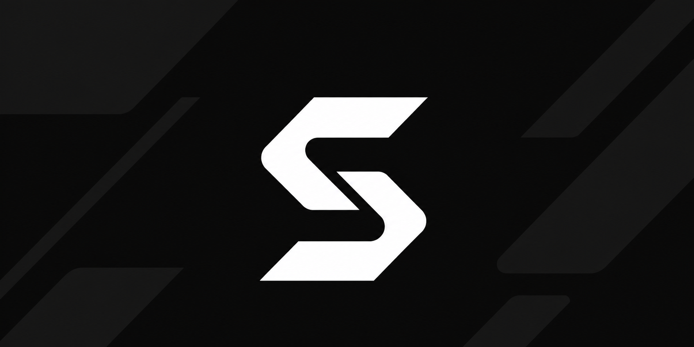
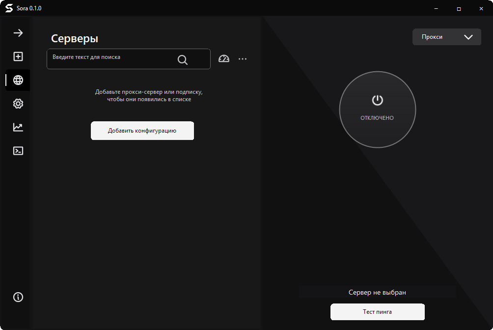

<p align="center">
  
</p>

<h1 align="center">Sora</h1>

<p align="center">
  Клиент подписок и подключений для Windows, Android и Linux, сделанный в духе Happ.
</p>

<p align="center">
  <a href="https://github.com/levvs-one/sora-client/releases/latest"><strong>Скачать последнюю версию</strong></a>
  &nbsp;·&nbsp;
  <a href="https://t.me/sora_client">Telegram</a>
</p>

<p align="center">
  
  
  <a href="LICENSE"></a>
</p>

Sora принимает HTTPS-подписки, отдельные ссылки VMess, VLESS, Trojan, Shadowsocks и SOCKS, Base64, SIP008 и конфигурации Xray JSON. Каждая подписка хранится отдельно: её можно развернуть, свернуть, обновить, переименовать или удалить вместе только с её серверами.

Android и Linux сейчас доступны только как проверочные сборки CI: релиза для них ещё нет. Они используют общий монохромный интерфейс и libXray, но сетевое поведение каждой платформы реализовано нативно — Android через `VpnService`, Linux через системный прокси или TUN с необходимыми правами.

В клиенте есть системный прокси, проверка задержки, автообновление подписок и фильтруемый журнал. Windows-сборки используют одну кодовую базу и различаются именем файла и профилем установщика: `sora_win7.exe`, `sora_win8.exe`, `sora_win10.exe` и `sora_win11.exe`.



## Установка

1. Открой [последний релиз](https://github.com/levvs-one/sora-client/releases/latest).
2. Скачай установщик для своей версии Windows и запусти его.
3. В Sora нажми кнопку добавления и вставь подписку или конфигурацию.

Установщик пока не подписан сертификатом. Перед запуском сверь SHA-256 с файлом контрольных сумм в релизе.

## Исходный код

Sora основана на [v2rayN 5.39](https://github.com/2dust/v2rayN/tree/529b6613e9193206277b2c2bfc3430ff17663f57). Для сборки нужны Windows и .NET SDK 8:

```powershell
dotnet restore .\v2rayN\v2rayN\v2rayN.csproj --runtime win7-x86
dotnet build .\v2rayN\v2rayN\v2rayN.csproj --configuration Release --runtime win7-x86 --no-restore --property:Platform=x86 --property:SoraWindowsTarget=win7
```

Код распространяется по [GNU GPL-3.0](LICENSE). Уведомления об исходном проекте и сторонних компонентах сохранены в [NOTICE.md](NOTICE.md) и [THIRD-PARTY-NOTICES.md](THIRD-PARTY-NOTICES.md).

- [История изменений](CHANGELOG.md)
- [Поддержка платформ](docs/platforms.md)
- [Сообщить об ошибке](https://github.com/levvs-one/sora-client/issues/new?template=01_bug_report.yml)
- [Предложить улучшение](https://github.com/levvs-one/sora-client/issues/new?template=02_feature_request.yml)
