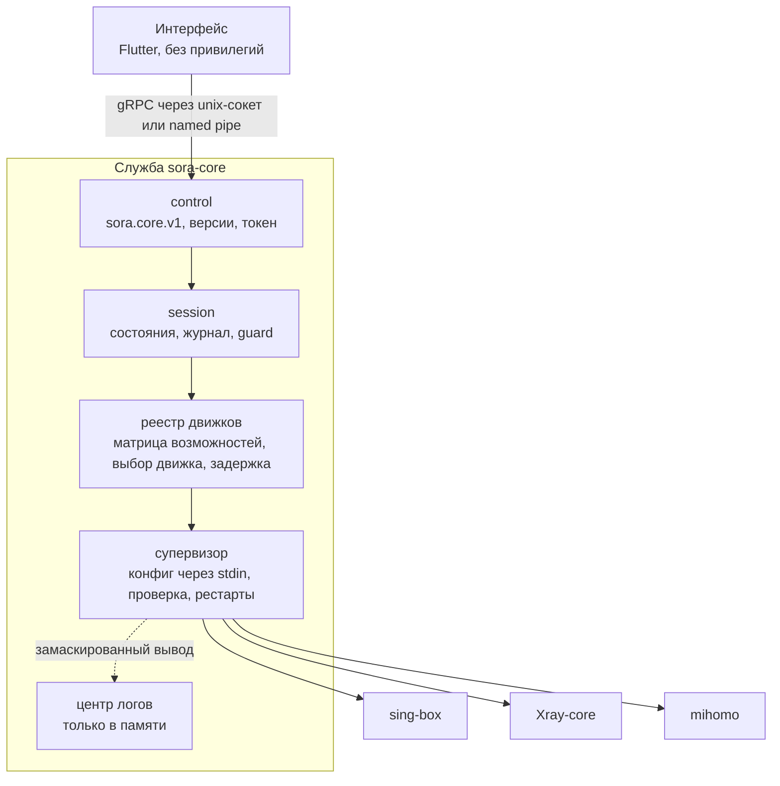

# Sora

Русский | [English](README.en.md)

Sora — открытый клиент прокси с одним ядром, которое управляет тремя движками:
sing-box, Xray-core и mihomo. Каждое подключение запускается на том движке, который
способен его провести. Sora рассчитана на сети, где блокируют, замедляют и
анализируют трафик: ядро выбирает транспорт, который сеть пропускает, не оставляет
на устройстве ничего, что выдало бы пользователя, и объясняет любой отказ понятными
словами.

Есть клиент для Linux (пакеты .deb, .rpm, Arch) и для Windows 10 и 11 (установщик).
Android в работе. Прежний клиент Sora Legacy живёт в ветке [`legacy`](https://github.com/levvs-one/sora-client/tree/legacy).

## Что умеет приложение

- **Одна кнопка.** Подключение, состояние парой слов и выбранный сервер — на одном
  экране. Пока идёт подключение, кнопка и край окна светятся; ошибка объясняется
  словами, а не кодом.
- **Подписки, которые следят за собой.** Ядро обновляет их по расписанию, даже когда
  окно закрыто, и держит в зашифрованном виде. Видно, сколько трафика потрачено, до
  какого числа подписка действует и что пишет провайдер, а его ссылки и `@имена`
  открываются. За три дня до конца срока или за десятую часть трафика Sora
  предупреждает на главном экране.
- **JSON-подписки Xray (Remnawave).** Каждый профиль работает так, как его написал
  провайдер: со своими балансировщиками, наблюдателем и маршрутами, а Sora
  добавляет к нему свой вход, DNS, блок рекламы и пресет маршрутов.
- **Самый быстрый сервер и запасной.** «Самый быстрый» выбирает ядро по замерам;
  выбранный вручную сервер подстрахован остальными и переключается при сбое.
  Задержка меряется по прогретому соединению, как её чувствует человек.
- **Свои правила.** Сайт, адрес, сеть или программа — напрямую, через VPN или
  блокировать. Правила по программам работают на всех трёх движках.
- **Без сервера.** Обход DPI через zapret (tpws) без VPN-сервера, с настраиваемой
  стратегией.
- **Центр логов и центр соединений** — на расстоянии одного шага, с выгрузкой и
  закрытием любого соединения.
- **На своём месте в системе.** Значок в трее с состоянием, сервером и режимом;
  закрытое окно уходит в трей, Sora запускается вместе с системой без окна.
  Уведомления — только о том, что случилось, пока окно не на виду: обрыв,
  возврат, переход на запасной сервер, конец подписки.
- **Ссылки из браузера и мессенджера.** `sora://` и кнопки «Добавить в Happ»
  (`happ://add`), а также ссылки v2rayN, Clash, Hiddify и sing-box открывают
  добавление подписки.
- **Весь трафик или системный прокси.** TUN ведёт все программы через адаптер;
  режим системного прокси направляет туда программы, которые его слушают, и
  возвращает прежние настройки при отключении. Служба ставит туннель без запроса
  прав администратора.
- Простые настройки сверху, тонкие — ниже: движок, IPv6, DNS, фрагментация TLS,
  способ замера, частота обновления подписок. Светлая и тёмная тема, русский и
  английский, анимации выключаются.

## Провайдерам: управление через названия серверов

Sora читает обычную подписку — ту же ссылку, что открывают Happ, v2rayN и Hiddify.
Дописывать в панель ничего не нужно: Sora понимает названия серверов.

**Одинаковое название — одна строка.** Несколько серверов одной подписки с одним
названием Sora показывает как один. Трафик несёт самый быстрый из тех, что ответили;
сервер, который не ответил на замер, не выбирается.

**Роль в конце названия — порядок.** Сначала основные, запасные — когда основные не
отвечают.

| Название в подписке | В Sora |
| --- | --- |
| `Нидерланды (основной)` | **Нидерланды**: трафик идёт сюда |
| `Нидерланды (запасной)` | …а сюда — если основной не отвечает |
| `Германия`, `Германия` | **Германия**: самый быстрый из двух |
| `Белые списки · main`, `Белые списки · backup` | **Белые списки**: тот же порядок по-английски |

Основной — `основной`, `главный`, `main`, `primary`. Запасной — `запасной`,
`резерв`, `резервный`, `backup`, `reserve`, `fallback`. Регистр не важен, перед
словом можно поставить скобки, тире, точку или двоеточие. Сервер без роли в группе,
где роли есть, считается запасным.

Порядок по ролям ведёт mihomo, и при автоматическом выборе движка Sora запускает
группу на нём. Если движок закреплён на sing-box или Xray, работают только основные —
самый быстрый из них. Профили JSON-подписки Xray переключаются самим приложением:
следующий подхватывает, когда текущий не поднялся.

Другие клиенты покажут те же серверы по отдельности, с теми же понятными названиями.

## Что умеет ядро

**Один план, три движка.** Сессия описывается один раз и не зависит от движка. Ядро
знает, что умеет каждая сборка движка — каждую строку этой матрицы проверил
собственный валидатор движка, — и запускает план на первом движке из порядка
пользователя, который проводит его целиком.

| Есть только здесь | Движок |
| --- | --- |
| XHTTP, VLESS Encryption, REALITY в варианте Xray, балансировка по замерам observatory | Xray-core |
| AnyTLS, tun с собственной таблицей маршрутов на всех платформах, наименьшее потребление памяти | sing-box |
| AmneziaWG 1.x и 2.0, fallback-группы, управление через сокет, применение плана на лету | mihomo |

Протоколы: VLESS (REALITY, XTLS Vision), VMess, Trojan, Shadowsocks (включая 2022),
Hysteria2, TUIC, AnyTLS, WireGuard, AmneziaWG, SOCKS5, HTTP. Транспорты: raw, ws,
grpc, httpupgrade, xhttp.

**Для сетей с цензурой.**

- Фрагментация TLS ClientHello против DPI, который блокирует по SNI; размер и
  интервалы фрагментов настраиваются.
- Задержка меряется настоящим запросом через движок, который проводит сервер, и
  приходит в интерфейс по мере готовности. Там, где ни один движок не подходит,
  сервер проверяется подключением, и результат говорит, каким способом он получен.
- Базы geoip и geosite поставляются вместе с Sora, поэтому первое подключение не
  ждёт загрузки с хоста, который заблокирован.

**Снаружи нечего найти.**

- В режиме tun нет локального прокси-порта: приложение, сканирующее loopback-порты,
  не может пустить запрос через туннель и узнать адрес сервера. Порт для выбранных
  приложений включается явно и может требовать логин.
- Движком по умолчанию управляют через unix-сокет или named pipe — на сканирование
  не отвечает ни один TCP-порт.
- Учётные данные хранятся зашифрованными (AES-256-GCM, ключ на Windows защищён
  DPAPI) и попадают в движок через stdin, а не через аргументы или файлы.
- Адреса серверов, UUID, пароли и ссылки подписок маскируются в каждом логе,
  событии и диагностическом архиве.

**Центр логов и центр соединений.** Одна запись службы и всех движков только в
памяти: фильтры по уровню, движку, тексту, регулярному выражению RE2 и времени,
живой просмотр, свёртка повторов, выгрузка в текст, JSON Lines и CSV. Уровень логов
меняется на всех движках сразу, без переподключения. Адреса посещённых сайтов
скрыты, пока пользователь сам их не включит, и на диск не пишется ничего. Центр
соединений показывает живые соединения с правилом, цепочкой групп и трафиком и
закрывает любое из них.

**Восстановление.** Движки — дочерние процессы под надзором: упавший движок
перезапускается с нарастающей паузой в пределах бюджета рестартов, каждое изменение
системы проходит через guard и откатывается на любом пути выхода, а kill switch —
своя таблица nftables на Linux и фильтры WFP на Windows — не даёт трафику уйти
мимо туннеля. При смене сети, новом адресе или пробуждении после сна сессия сама
закрывает соединения, оставшиеся на старом пути, и программы переподключаются
сразу, а не ждут тайм-аута.
Сессия в режиме tun считается подключённой, только когда адаптер `sora0`
действительно поднят: движок, который запустился без прав на адаптер, не выдаст
себя за работающий туннель.

## Как это проверяется

| Проверка | Что доказывает |
| --- | --- |
| Валидаторы движков | каждый план после сборки конфигурации принимают `sing-box check`, `xray run -test` и `mihomo -t` |
| Сквозной трафик | настоящий HTTP-запрос проходит через каждый движок по каждому транспорту до локального сервера Xray; неверный UUID обязан не пройти ни через один движок, поэтому успех не может оказаться трафиком мимо прокси |
| Изоляция | без локального прокси в плане порт никто не слушает; закрытый логином порт отказывает в запросе без логина — на всех трёх движках |
| Маскирование | вывод движков доходит до центра логов, учётные данные — нет |
| Надзор | поддельный движок из тестового бинарника падает, перезапускается и исчерпывает бюджет — в CI, без установленных движков |
| Туннель целиком | в сетевом пространстве имён настоящее ядро поднимает tun на каждом движке, программа другого пользователя получает страницу через сервер VLESS, после отключения не остаётся ни правил, ни адаптера |
| Kill switch | набор правил загружается в настоящий nftables: мимо туннеля — отказ, через `sora0`, loopback и локальную сеть — проходит |
| Windows | в CI на windows-latest установщик ставит службу, приложение подключается к ней через именованный канал, настоящий трафик идёт через TUN и через системный прокси до локального сервера VLESS, kill switch на WFP пропускает loopback и блокирует чужую программу, удаление снимает службу |
| CI | детектор гонок, сборка под Windows, Linux и macOS на amd64 и arm64, golangci-lint, CodeQL, govulncheck, OSV, gitleaks, линт и проверка совместимости контракта |

Проверенные сборки движков: sing-box 1.14.2, Xray-core 26.3.27, mihomo 1.19.32.

## Архитектура


```mermaid
flowchart TB
    ui["Интерфейс<br/>Flutter, без привилегий"]
    subgraph core["Служба sora-core"]
        control["control<br/>sora.core.v1, версии, токен"]
        session["session<br/>состояния, журнал, guard"]
        registry["реестр движков<br/>матрица возможностей, выбор движка, задержка"]
        supervise["супервизор<br/>конфиг через stdin, проверка, рестарты"]
        logs["центр логов<br/>только в памяти"]
    end
    ui -- "gRPC через unix-сокет или named pipe" --> control
    control --> session --> registry --> supervise
    supervise --> sb["sing-box"]
    supervise --> xr["Xray-core"]
    supervise --> mh["mihomo"]
    supervise -. "замаскированный вывод" .-> logs
```

Подробнее: [ядро](docs/architecture/core.md), [движки](docs/architecture/engines.md),
[центр логов и соединений](docs/architecture/logs.md).

## Структура репозитория

| Каталог | Что внутри |
| --- | --- |
| [`core`](core/README.md) | `sora-core` на Go: движки, control plane, подписки, хранилище секретов, guard, диагностика, центр логов |
| [`proto`](proto/README.md) | Контракт `sora.core.v1` между интерфейсом и ядром |
| [`app`](app/README.md) | Приложение на Flutter для Windows, Linux, Android и Android TV |
| [`service`](service) | Установка и жизненный цикл службы ядра на Windows и Linux |
| [`packaging`](packaging/README.md) | Установщики и пакеты |

## Платформы

| Система | Что есть |
| --- | --- |
| Linux x64 | приложение и ядро: пакеты .deb, .rpm и Arch ([packaging/linux](packaging/linux/README.md)) |
| Linux ARM64 | ядро (Flutter не выпускает SDK для Linux на ARM64) |
| Windows 10 1809+ и 11, x64 | приложение, ядро как служба, установщик ([packaging/windows](packaging/windows/README.md)) |
| Windows 7 SP1, x32 | Sora Legacy в ветке [`legacy`](https://github.com/levvs-one/sora-client/tree/legacy); новое ядро и движки для Windows 7 уже собираются, интерфейсу нужна отдельная сборка — Flutter Windows 7 не поддерживает |
| Android, Android TV | в работе |

## Сборка ядра

Нужен Go 1.26 или новее.

```sh
cd core
go test -race ./...
```

Если под рукой есть сборки движков, тесты дополнительно прогоняют каждый план через
движки и пропускают через них трафик:

```sh
SORA_SINGBOX_BIN=... SORA_XRAY_BIN=... SORA_MIHOMO_BIN=... SORA_ENGINES_DIR=... go test ./...
```

## Участие и безопасность

Правила разработки — в [CONTRIBUTING.md](CONTRIBUTING.md). Об уязвимостях сообщайте
закрыто, как описано в [SECURITY.md](SECURITY.md).

## Лицензия

[GNU GPL-3.0](LICENSE). Сторонние компоненты перечислены в [NOTICE.md](NOTICE.md) и
[THIRD-PARTY-NOTICES.md](THIRD-PARTY-NOTICES.md).
