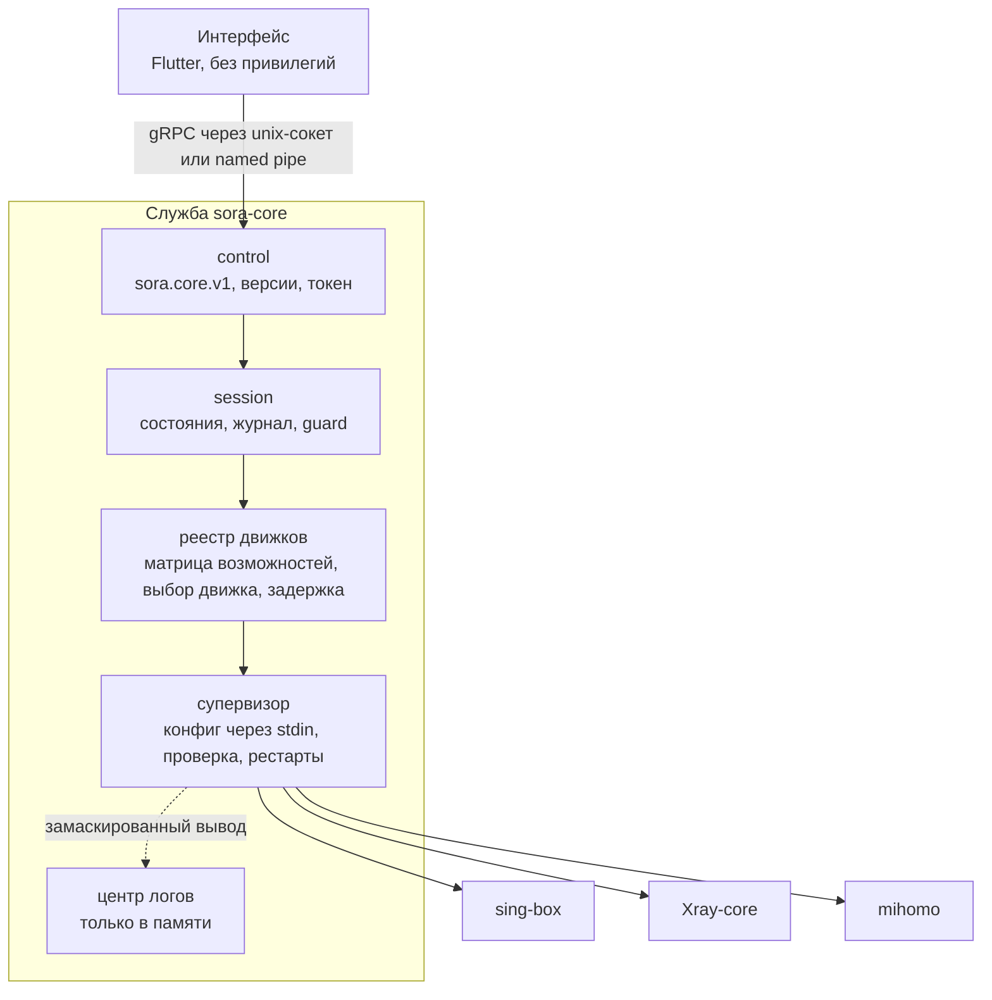

# Sora

Русский | [English](README.en.md)

Sora — открытый клиент прокси с одним ядром, которое управляет тремя движками:
sing-box, Xray-core и mihomo. Каждое подключение запускается на том движке, который
способен его провести. Sora рассчитана на сети, где блокируют, замедляют и
анализируют трафик: ядро выбирает транспорт, который сеть пропускает, не оставляет
на устройстве ничего, что выдало бы пользователя, и объясняет любой отказ понятными
словами.

Новый клиент в разработке. Ядро работает и проверено сквозными тестами на настоящих
сборках движков; интерфейс для компьютера и Android строится поверх него. Прежний
клиент для Windows, Sora Legacy, лежит в [`legacy`](legacy/README.md) и получает
только исправления безопасности.

## Что умеет ядро

**Один план, три движка.** Сессия описывается один раз и не зависит от движка. Ядро
знает, что умеет каждая сборка движка — каждую строку этой матрицы проверил
собственный валидатор движка, — и запускает план на первом движке из порядка
пользователя, который проводит его целиком.

| Есть только здесь | Движок |
| --- | --- |
| XHTTP, VLESS Encryption, REALITY в варианте Xray, балансировка по замерам observatory | Xray-core |
| AnyTLS, tun с собственной таблицей маршрутов на всех платформах, наименьшее потребление памяти | sing-box |
| AmneziaWG 1.x и 2.0, fallback-группы, управление через сокет, применение плана на лету | mihomo |

Протоколы: VLESS (REALITY, XTLS Vision), VMess, Trojan, Shadowsocks (включая 2022),
Hysteria2, TUIC, AnyTLS, WireGuard, AmneziaWG, SOCKS5, HTTP. Транспорты: raw, ws,
grpc, httpupgrade, xhttp.

**Для сетей с цензурой.**

- Фрагментация TLS ClientHello против DPI, который блокирует по SNI; размер и
  интервалы фрагментов настраиваются.
- Задержка меряется настоящим запросом через движок, который проводит сервер, и
  приходит в интерфейс по мере готовности. Там, где ни один движок не подходит,
  сервер проверяется подключением, и результат говорит, каким способом он получен.
- Базы geoip и geosite поставляются вместе с Sora, поэтому первое подключение не
  ждёт загрузки с хоста, который заблокирован.

**Снаружи нечего найти.**

- В режиме tun нет локального прокси-порта: приложение, сканирующее loopback-порты,
  не может пустить запрос через туннель и узнать адрес сервера. Порт для выбранных
  приложений включается явно и может требовать логин.
- Движком по умолчанию управляют через unix-сокет или named pipe — на сканирование
  не отвечает ни один TCP-порт.
- Учётные данные хранятся зашифрованными (AES-256-GCM, ключ на Windows защищён
  DPAPI) и попадают в движок через stdin, а не через аргументы или файлы.
- Адреса серверов, UUID, пароли и ссылки подписок маскируются в каждом логе,
  событии и диагностическом архиве.

**Центр логов и центр соединений.** Одна запись службы и всех движков только в
памяти: фильтры по уровню, движку, тексту, регулярному выражению RE2 и времени,
живой просмотр, свёртка повторов, выгрузка в текст, JSON Lines и CSV. Уровень логов
меняется на всех движках сразу, без переподключения. Адреса посещённых сайтов
скрыты, пока пользователь сам их не включит, и на диск не пишется ничего. Центр
соединений показывает живые соединения с правилом, цепочкой групп и трафиком и
закрывает любое из них.

**Восстановление.** Движки — дочерние процессы под надзором: упавший движок
перезапускается с нарастающей паузой в пределах бюджета рестартов, каждое изменение
системы проходит через guard и откатывается на любом пути выхода, а на Linux
kill switch на собственной таблице nftables не даёт трафику уйти мимо туннеля, пока
туннель не поднят.

## Как это проверяется

| Проверка | Что доказывает |
| --- | --- |
| Валидаторы движков | каждый план после сборки конфигурации принимают `sing-box check`, `xray run -test` и `mihomo -t` |
| Сквозной трафик | настоящий HTTP-запрос проходит через каждый движок по каждому транспорту до локального сервера Xray; неверный UUID обязан не пройти ни через один движок, поэтому успех не может оказаться трафиком мимо прокси |
| Изоляция | без локального прокси в плане порт никто не слушает; закрытый логином порт отказывает в запросе без логина — на всех трёх движках |
| Маскирование | вывод движков доходит до центра логов, учётные данные — нет |
| Надзор | поддельный движок из тестового бинарника падает, перезапускается и исчерпывает бюджет — в CI, без установленных движков |
| CI | детектор гонок, сборка под Windows, Linux и macOS на amd64 и arm64, golangci-lint, CodeQL, govulncheck, OSV, gitleaks, линт и проверка совместимости контракта |

Проверенные сборки движков: sing-box 1.14.2, Xray-core 26.3.27, mihomo 1.19.32.

## Архитектура


```mermaid
flowchart TB
    ui["Интерфейс<br/>Flutter, без привилегий"]
    subgraph core["Служба sora-core"]
        control["control<br/>sora.core.v1, версии, токен"]
        session["session<br/>состояния, журнал, guard"]
        registry["реестр движков<br/>матрица возможностей, выбор движка, задержка"]
        supervise["супервизор<br/>конфиг через stdin, проверка, рестарты"]
        logs["центр логов<br/>только в памяти"]
    end
    ui -- "gRPC через unix-сокет или named pipe" --> control
    control --> session --> registry --> supervise
    supervise --> sb["sing-box"]
    supervise --> xr["Xray-core"]
    supervise --> mh["mihomo"]
    supervise -. "замаскированный вывод" .-> logs
```

Подробнее: [ядро](docs/architecture/core.md), [движки](docs/architecture/engines.md),
[центр логов и соединений](docs/architecture/logs.md).

## Структура репозитория

| Каталог | Что внутри |
| --- | --- |
| [`core`](core/README.md) | `sora-core` на Go: движки, control plane, подписки, хранилище секретов, guard, диагностика, центр логов |
| [`proto`](proto/README.md) | Контракт `sora.core.v1` между интерфейсом и ядром |
| [`app`](app/README.md) | Приложение на Flutter для Windows, Linux, Android и Android TV |
| [`service`](service) | Установка и жизненный цикл службы ядра на Windows и Linux |
| [`packaging`](packaging/README.md) | Установщики и пакеты |
| [`legacy`](legacy/README.md) | Sora Legacy для Windows 7–11 |

## Платформы

| Система | Версии | Архитектуры |
| --- | --- | --- |
| Windows | 10 версии 1809 и новее, 11 | x64, ARM64 |
| Linux | Debian 12+, Ubuntu 22.04+, Fedora 39+, openSUSE, AppImage | x64, ARM64 |
| Android | 8.0 и новее, Android TV | arm64-v8a, armeabi-v7a, x86_64 |

## Сборка ядра

Нужен Go 1.26 или новее.

```sh
cd core
go test -race ./...
```

Если под рукой есть сборки движков, тесты дополнительно прогоняют каждый план через
движки и пропускают через них трафик:

```sh
SORA_SINGBOX_BIN=... SORA_XRAY_BIN=... SORA_MIHOMO_BIN=... SORA_ENGINES_DIR=... go test ./...
```

## Участие и безопасность

Правила разработки — в [CONTRIBUTING.md](CONTRIBUTING.md). Об уязвимостях сообщайте
закрыто, как описано в [SECURITY.md](SECURITY.md).

## Лицензия

[GNU GPL-3.0](LICENSE). Сторонние компоненты перечислены в [NOTICE.md](NOTICE.md) и
[THIRD-PARTY-NOTICES.md](THIRD-PARTY-NOTICES.md).
