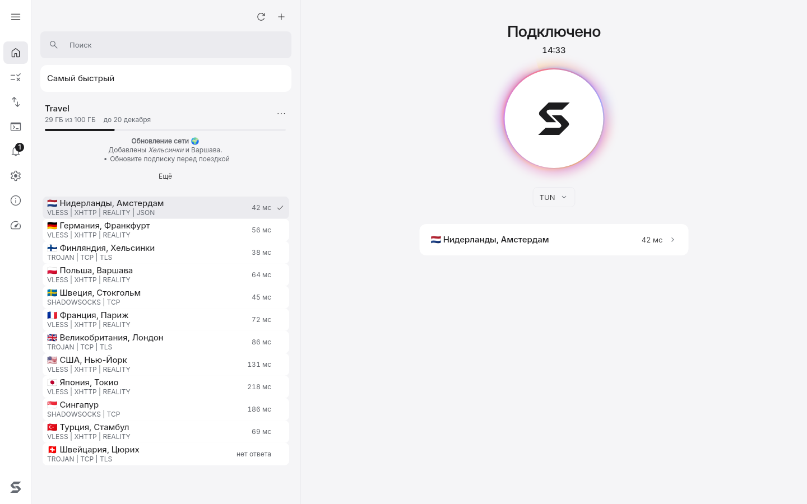
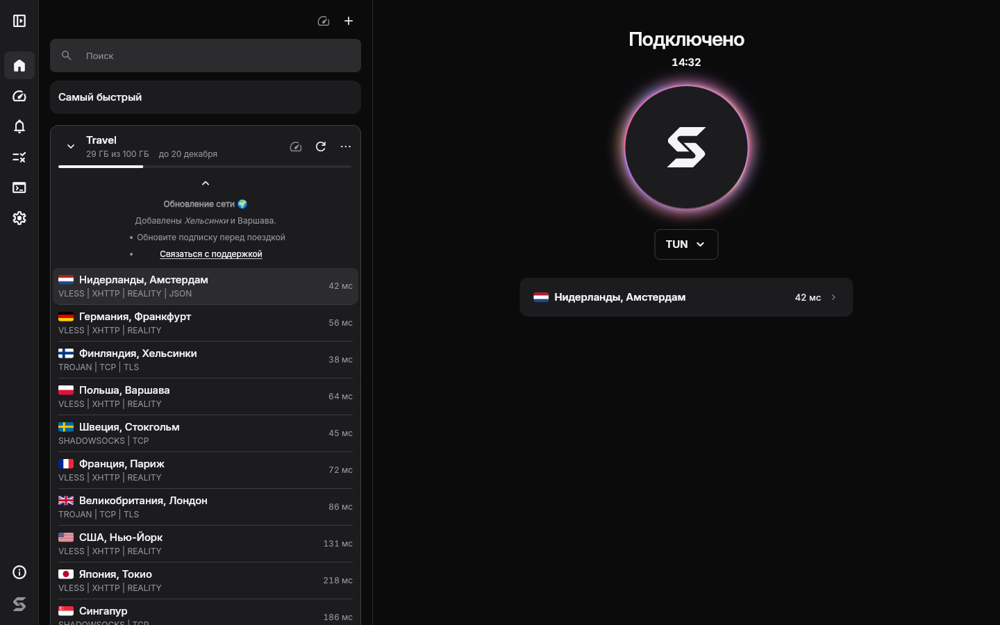

# Sora

[English](README.en.md)

VPN-клиент Sora с открытым исходным кодом работает на Windows и Linux. Он предназначен для тех, у кого есть подписка от VPN-провайдера: добавьте ссылку, выберите сервер и подключитесь.



<details>
<summary>Тёмная тема</summary>



</details>

## Установка

Windows 10 1809+ или Windows 11, x64. В PowerShell:

```powershell
irm https://github.com/levvs-one/sora-client/releases/latest/download/install.ps1 | iex
```

Linux x64: Debian, Ubuntu, Fedora, openSUSE, Arch. В терминале:

```sh
curl -fsSL https://github.com/levvs-one/sora-client/releases/latest/download/install.sh | sh
```

Скрипты скачивают последний релиз, проверяют контрольные суммы и устанавливают приложение со службой. Установка требует прав администратора. Для ручной установки скачайте установщик или пакеты со страницы [релизов](https://github.com/levvs-one/sora-client/releases).

## Что умеет Sora

- Добавляет подписки по ссылке, включая JSON-подписки Xray. Обновляет серверы по расписанию и показывает трафик, срок и объявления, если их передаёт провайдер.
- Выбирает сервер с наименьшей задержкой и поддерживает запасные серверы при сбое.
- Подключает программы через виртуальный сетевой адаптер (TUN) или системный прокси.
- Блокирует интернет при обрыве VPN, если включён kill switch.
- Отправляет выбранные сайты, IP-адреса и программы напрямую, через VPN или блокирует их.
- На Linux обходит часть блокировок через zapret без сервера. Этот режим не скрывает IP-адрес и не заменяет VPN.
- Открывает сервисы проверки скорости внутри приложения, сохраняет историю уведомлений и показывает журнал и активные соединения.
- Работает из трея, запускается при входе в систему и обновляется из приложения. Есть русский и английский интерфейс, светлая и тёмная темы.

## Документация

- [Установка, обновление и удаление](docs/install.md)
- [Как пользоваться](docs/usage.md)
- [Форматы подписок и информация для провайдеров](docs/providers.md)
- [Если что-то не работает](docs/troubleshooting.md)
- [Как устроена Sora](docs/architecture.md)
- [Разработка и сборка](docs/development.md)
- [История изменений](CHANGELOG.md)

## Лицензия

[GPL-3.0](LICENSE). [Лицензии сторонних компонентов](THIRD-PARTY-NOTICES.md).
